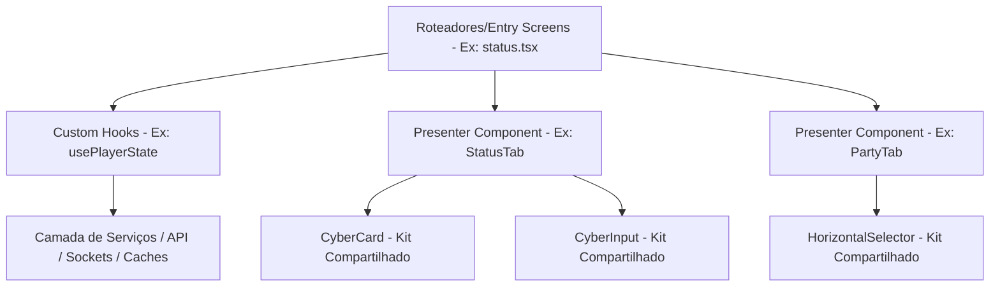
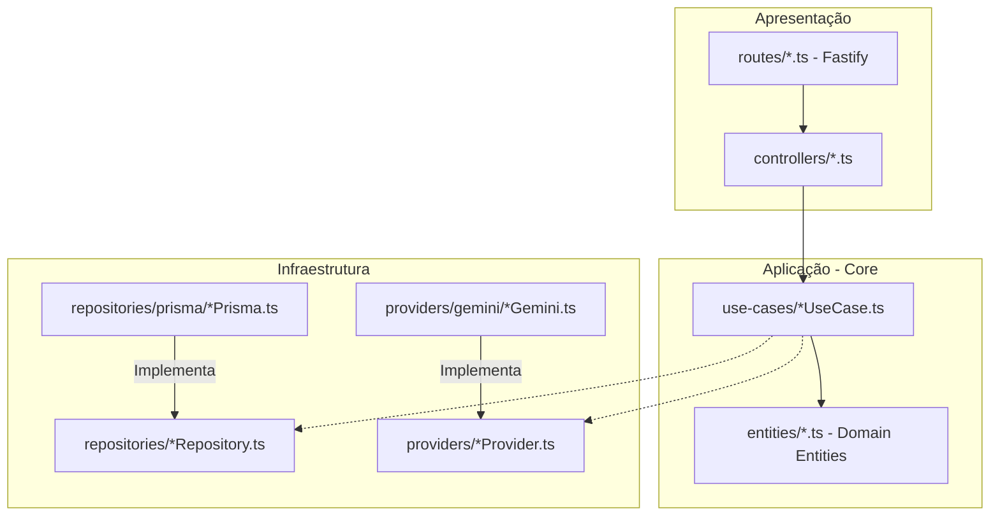

# Projeto: Solo Learning (MVP)
**Estética:** Inspirada no Manhwa "Solo Leveling" (Status windows, Ranks, Daily Quests).

## 1. Stack Tecnológica (Obrigatória)
- **Frontend:** React Native com Expo (TypeScript).
- **Backend:** Node.js com Fastify ou Express (TypeScript).
- **ORM:** Prisma com PostgreSQL.
- **IA:** OpenAI API (GPT-4o para texto e Vision para correção de fotos).
- **Estilização:** NativeWind (Tailwind CSS para React Native).

## 2. Core Business Logic
- **Personas:** Professor (Admin/Criador de Quests) e Aluno (Player).
- **Sistema de Quest:** - O Professor define o tema (ex: Equações de 1º Grau).
    - A IA gera o conteúdo da Quest (Enunciado + Gabarito lógico).
    - O Aluno responde via texto ou foto de resolução manuscrita.
- **Sistema de Gamificação:** - Conclusão gera XP e aumento de Level.
    - Falha ou expiração de tempo gera "Penalty Quest" (Penalidade).
- **Social:** Sistema de "Party" para missões em grupo.

## 3. Estrutura de Pastas Esperada
/root
  /backend (Node.js API)
  /frontend (React Native App)
  /shared (Interfaces TS e Tipagens comuns)

## 4. Arquitetura do Frontend (Evolução & Refatoração)

Para combater a complexidade de arquivos monolíticos (que ultrapassavam milhares de linhas) e eliminar a duplicação de layouts e estilos, o frontend do Solen foi reestruturado de acordo com o **Plano de Evolução Arquitetural** aprovado. Esta nova estrutura separa completamente as preocupações de negócio, estados e representações visuais em três camadas independentes:

### 4.1. Camada de Estado (Custom Hooks)
Toda a lógica de negócios, gerenciamento de estados (`useState`, `useRef`), chamadas de serviços e sincronização assíncrona foi movida para hooks reutilizáveis localizados em `hooks/`:
- **`hooks/usePlayerState.ts`**: Centraliza o estado do aluno (Daily Quests, baú de erros com decaimento de XP, party com chats persistentes, buffs ativos e expiração de tempo).
- **`hooks/useMestreState.ts`**: Coordena o estado do professor (geração de quests por IA, monitoramento de radar em tempo real, importação e edição de turmas).
- **`hooks/useAdminState.ts`**: Gerencia o painel administrativo (cadastro e associação de professores, turmas, matérias e perguntas douradas).

*Benefício:* Reduz os arquivos de tela principais para menos de 100 linhas, mantendo-os puros e livres de lógica paralela.

### 4.2. CyberUI Component Kit (Shared UI)
Componentes de interface de usuário padronizados com estética **Solo Leveling** (fundo escuro, glows neon dinâmicos e tipografias modernas) localizados em `components/ui/`:
- **`CyberCard`** (`components/ui/CyberCard.tsx`): Contêineres modulares com sombras de glow neon customizadas para status de aviso, sucesso, falha ou BOSS.
- **`CyberInput`** (`components/ui/CyberInput.tsx`): Inputs de texto cibernéticos com suporte a Feather icons, mensagens de erro dinâmicas e foco com transições suaves.
- **`CyberBadge`** (`components/ui/CyberBadge.tsx`): Chips e tags estilizados com cores harmoniosas obtidas através do sistema HSL Tailored.
- **`HorizontalSelector`** (`components/ui/HorizontalSelector.tsx`): Seletor horizontal premium que elimina ScrollViews duplicados para escolha de turmas, matérias ou turnos acadêmicos.
- **`CyberAccordion`** (`components/ui/CyberAccordion.tsx`): Abstração animada para caixas colapsáveis com rotação de chevron e haptic/audio feedback embutidos.

### 4.3. Camada de Apresentação (Aba Presenters)
Componentes puros que apenas recebem propriedades e desenham as abas específicas de cada perfil dentro de `components/`:
- **`components/player/`**: `StatusTab`, `BauTab`, `PartyTab`, `QuestWindowModal`, `RankUpModal`.
- **`components/mestre/`**: `ForjaTab`, `TurmasTab`, `RadarTab`, `HistoricoTab`, `MateriasTab`, `GradeTab`, `AgendaTab`, `AjudasTab`.
- **`components/admin/`**: `SistemaTab`, `TurmasTab`, `MateriasTab`, `ArquitetoTab`, `RecrutarTab`, `GradeTab`.

### 4.4. Controladores de Rota (Entry Screens)
Arquivos do Expo Router responsáveis por inicializar os hooks de estado e distribuir as propriedades correspondentes para as abas ativas:
- **`app/(player)/status.tsx`**
- **`app/(mestre)/dashboard.tsx`**
- **`app/(admin)/dashboard.tsx`**

---

## 5. Arquitetura do Backend (Clean Architecture & SOLID)

Para garantir escalabilidade, testabilidade e separação total de responsabilidades, o backend do Solen foi refatorado seguindo os princípios de **Clean Architecture (Arquitetura Limpa)** e padrões **SOLID**.

A estrutura de código está dividida em 3 camadas concêntricas e independentes:

### 5.1. Camada de Domínio & Core (Regras de Negócio Puras)
- **`src/core/repositories/`**: Interfaces de repositórios que definem contratos puros de acesso a dados (ex: `IUserRepository`, `IQuestRepository`), garantindo que o núcleo do sistema não dependa de ORMs ou bancos de dados específicos.
- **`src/core/use-cases/`**: Classes focadas em executar uma única regra de negócio com total isolamento técnico.
  - **`LoginUseCase`**: Valida credenciais e regras de acesso de alunos (primeiro acesso) e mestres.
  - **`FirstAccessUseCase`**: Trata o fluxo inicial de novos jogadores, atualizando credenciais de acesso com hash robusto.
  - **`GenerateAIQuestsUseCase`**: Coordena o prompt avançado e a geração assistida por IA de lotes de 3 missões com progressão lógica de dificuldade (Fácil, Médio, Difícil).
  - **`ApproveQuestBatchUseCase`**: Ativa lotes de rascunhos de missões geradas, agendando a entrega de forma paralela e disparando notificações em massa.
- **`src/core/providers/`**: Interfaces abstratas para integrações de terceiros (`IAIProvider`, `INotificationProvider`).

### 5.2. Camada de Infraestrutura (Implementações Concretas)
- **`src/infra/database/repositories/`**: Implementações reais dos repositórios acopladas à tecnologia do banco de dados:
  - **`PrismaUserRepository`**: Lida com todas as queries relacionais de usuários e exclusões seguras em transação cascata via Prisma Client.
  - **`PrismaQuestRepository`**: Gerencia buscas e atualizações de masmorras de quests e filas de entrega do aluno.
- **`src/infra/providers/`**: Serviços externos concretos acoplados à infraestrutura:
  - **`GeminiAIProvider`**: Executa chamadas à API da Google Generative AI com mecanismo inteligente e autônomo de **rotação de API Keys** em caso de rate-limit/exaustão de cota.
  - **`ExpoNotificationProvider`**: Realiza o disparo assíncrono de Push Notifications para os dispositivos móveis dos alunos através do gateway da Expo.

### 5.3. Camada de Apresentação & Adaptadores HTTP
- **`src/presentation/controllers/`**: Controladores HTTP limpos que convertem os parâmetros de rede (`FastifyRequest`, `FastifyReply`), acionam os Use Cases correspondentes e formatam o retorno.
  - **`AuthController`**: Gerencia login, primeiro acesso e detalhes de perfil.
  - **`QuestController`**: Gerencia geração, rascunhos e aprovação de masmorras de quests.
- **`src/presentation/routes/`**: Define as rotas do Fastify, injetando e instanciando as dependências corretas em tempo de inicialização do plugin.