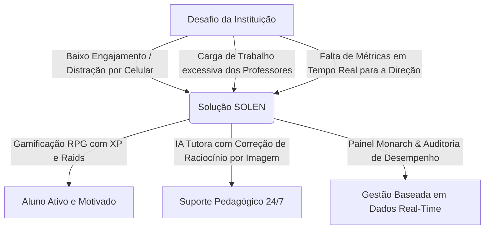

# 🎬 Campanha Promocional B2B / B2G: SOLEN — A Jornada do Conhecimento

> **Direção de Marketing (CMO Concept):** Uma produção cinematográfica de 90 segundos desenhada para impactar Secretários de Educação, Diretores Escolares e Coordenadores Pedagógicos. O comercial combina a narrativa inspiradora das maiores produções EdTech com a estética épica e eletrizante de gamificação RPG e Inteligência Artificial.

---

## 📌 1. Ficha Técnica & Estratégia de Posicionamento

| Item | Especificação |
| :--- | :--- |
| **Título da Campanha** | *O Fim do Desinteresse. O Início da Jornada.* |
| **Duração** | 90 segundos (1min 30s) |
| **Estilo Visual** | *Cinematic High-Tech Fantasy* (Mistura de estúdio premiado estilo Apple/Nike com a estética épica de *Solo Leveling* / *Arcane*) |
| **Público-Alvo** | Diretores Escolares, Secretários Municipais/Estaduais de Educação, Coordenadores Pedagógicos |
| **Objetivo Principal** | Apresentar o Solen como a solução definitiva para o engajamento e acompanhamento pedagógico via IA e Gamificação RPG |
| **Métrica Chave (Pitch)** | **+300% de Engajamento** • **0% de Abandono de Tarefas** • **IA Tutora Rigorosa 24/7** • **Alinhamento BNCC Automático** |

---

## 🎭 2. Roteiro Cinematográfico Cena a Cena (90s)

### **[00:00 - 00:15] — O Diagnóstico: O Abismo da Desconexão**

- **Visual:** Câmera desliza em *travelling* por uma sala de aula comum. Alunos apáticos olhando para o quadro negro ou distraídos. O relógio de parede avança devagar. Sombreado frio, cores dessaturadas.
- **Áudio / SFX:** Som de tique-taque abafado do relógio. Ruído branco de sala de aula desmotivada.
- **Locução (Voz grave, reflexiva, inspiradora):**
  > *"Como ensinar uma geração que nasceu conectada com o mundo... dentro de um modelo educacional desconectado da realidade deles?"*
  > *"O desinteresse não é falta de capacidade. É falta de propósito."*

---

### **[00:15 - 00:35] — A Descoberta: A Mudança de Paradigma**

- **Visual:** Uma aluna segura um tablet/celular. A tela ilumina o rosto dela com uma aura dourada e neon. Transição rápida de cores: a sala de aula ganha vida com partículas holográficas brilhantes de energia azul e dourada.
- **Áudio / SFX:** Transição sonora épica (swoosh cristalino + batida grave de sintetizador estilo *Hans Zimmer*). A música começa a construir ritmo acelerado.
- **Locução:**
  > *"E se cada tarefa escolar se transformasse em uma missão épica?"*
  > *"E se o dever de casa deixasse de ser um fardo... para se tornar a batalha diária do conhecimento?"*
  > *"Apresentamos o SOLEN."*

---

### **[00:35 - 00:60] — O Ecossistema em Ação: Tecnologia, IA & RPG**

- **Visual (Rápido / Dinâmico - Carrossel de Funcionalidades do App):**
  1. **IA Tutora Defensora (Gemini OCR):** Um aluno tira uma foto do caderno com um cálculo feito à mão. A IA analisa a imagem holograficamente e fornece feedback pedagógico imediato.
  2. **Dungeons & Boss Battles:** A turma unida em modo *Party Raid* enfrentando um "Mini Boss de Matemática" holográfico. Os alunos vibram juntos na sala ao resolverem os exercícios.
  3. **Artefatos & Recompensas:** Animação 3D de artefatos lendários sendo desbloqueados no inventário (*Chapéu do Archmago*, *Poeira Estelar*).
- **Áudio / SFX:** Trilha sonora no clímax épico. Sons digitais de conquista, *level up* e vitórias em grupo.
- **Locução:**
  > *"Com Inteligência Artificial integrada, o Solen analisa a escrita do aluno em tempo real, corrigindo raciocínios e respeitando o nível estrito de cada série escolar — do 5º ano ao Ensino Médio."*
  > *"Missões individuais, batalhas de guilda em grupo e um acervo pedagógico que transforma o aprendizado em cooperação real."*

---

### **[00:60 - 00:75] — O Valor Institucional: O Poder de Decisão para a Gestão**

- **Visual:** Transição suave para um diretor ou coordenador pedagógico utilizando o painel **Monarch Engine** em um monitor ou tablet. Gráficos em tempo real mostram taxa de acertos por disciplina, logs de auditoria por turma e relatórios consolidados de desempenho.
- **Áudio / SFX:** Trilha sonora ganha um tom sofisticado, elegante e corporativo.
- **Locução:**
  > *"Para os gestores e professores, o Solen oferece o Motor Monarch: controle total da matriz curricular, geração automatizada de horários, métricas analíticas por matéria e isolamento seguro de dados para a sua instituição."*

---

### **[00:75 - 00:90] — O Encerramento: Chamada para Ação Épica**

- **Visual:** Os alunos se levantam sorrindo e confiantes na sala de aula iluminada. O logotipo do **SOLEN** surge em letras holográficas reluzentes com o slogan.
- **Áudio / SFX:** Acorde final triunfal e inspirador.
- **Texto na Tela (Lower Thirds):**
  - **SOLEN — Educational RPG & AI System**
  - *Agende uma demonstração para sua instituição: solen.app*
- **Locução:**
  > *"Não mude o aluno. Mude a forma de ensinar."*
  > *"Traga o Solen para a sua instituição e desperte os heróis do futuro hoje."*

---

## 🏆 3. Pitch Comercial B2B/B2G para Instituições de Ensino

Quando você for apresentar este vídeo ou fazer a reunião de vendas com **Diretores de Escolas Particulares** ou **Secretarias Municipais/Estaduais de Educação**, utilize este quadro de argumentos:

### Principais Pilares de Venda:

1. **Gamificação com Propósito Educacional:** Não é um jogo aleatório, é a matriz de questões da própria escola transformada em Dungeons.
2. **Inteligência Artificial Educacional Segura:** A IA avalia o raciocínio matemático e textual (incluindo fotos de cálculos no caderno) sem dar respostas diretas, estimulando a autonomia.
3. **Gestão Inteligente (Monarch Engine):** Distribuição de horários de aula sem conflitos, relatórios por disciplina e auditoria de ações dos alunos e turmas.
4. **Arquitetura Multitenant & SAIF Compliant:** Segurança de dados rigorosa, isolamento por instituição e conformidade com LGPD.

---

## 🎨 4. Guia de Produção com IA (Prompts para Vídeo & Imagens)

Se você desejar gerar os trechos em vídeo usando ferramentas como **Sora**, **Runway Gen-2**, **Pika** ou **Midjourney**, utilize estes prompts pré-configurados:

- **Cena 1 (Abertura):**
  > `Cinematic slow motion shot of a quiet modern Brazilian classroom, moody cool blue lighting, students looking thoughtful, hyperrealistic, 8k resolution, cinematic depth of field --ar 16:9`
- **Cena 2 (Transformação):**
  > `High tech glowing golden and cyan energy particles bursting from a digital tablet in a student's hands, dynamic camera movement, epic lighting, photorealistic --ar 16:9`
- **Cena 3 (Painel de Gestão Monarch):**
  > `Over the shoulder shot of a school principal looking at a sleek futuristic dark mode dashboard analytics interface on a widescreen display, glowing charts, professional lighting --ar 16:9`
