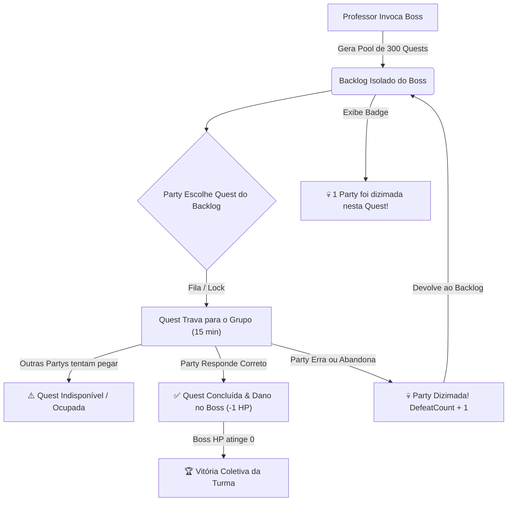

# ⚔️ Plano de Redesign: Sistema de Mega Boss (Pool de 300 Quests & Fila Dinâmica)

Este documento apresenta a proposta completa de arquitetura e mecânica para o novo **Sistema de Mega Boss** do aplicativo **COLLEGIUM**, substituindo a antiga mecânica de questão única "insanamente difícil" por uma **Batalha de Guilda/Turma com Pool de 300 Quests**, **Mecânica de Fila/Trava** e **Backlog Isolado com Contador de Derrotas Anônimas**.

---

## 📌 1. Visão Geral: O Problema vs. A Nova Solução

### ❌ O Problema Atual
- O Boss antigo criava uma única questão gerada por IA com nível de dificuldade extremamente alto, tornando a resposta quase impossível, desmotivando os alunos e frustrando a experiência de jogo.

### ✅ A Nova Proposta de Mega Boss
1. **Barra de Vida Épica (Boss HP):** O Boss possui uma barra de vida gigante (ex: 300 HP). Cada quest resolvida pela turma causa dano e reduz a barra de vida.
2. **Pool de 300 Quests Isoladas (Boss Backlog):** Em vez de 1 questão impossível, o Boss possui um reservatório de **300 questões de nível calibrado** (fácil/médio/desafiador) alinhadas à série e matéria. Essas questões ficam exclusivamente no evento de Boss e não se misturam com as tarefas normais da semana.
3. **Mecânica de Fila e Trava (Lock System):** Quando uma Party (or Aluno Solo) seleciona uma quest do backlog do Boss para resolver, essa quest fica **RESERVADA / TRAVADA** para aquele grupo. Nenhuma outra Party pode selecionar a mesma questão enquanto o grupo estiver tentando.
4. **Desistência / Derrota e Contador Anônimo ("Wipe Counter"):** Se a Party erra ou desiste da quest (ou o tempo do lock estoura), a quest é liberada de volta para o backlog do Boss com um aviso anônimo:
   > 💀 *"1 Party foi dizimada nesta Quest!"* (ou *"2 Parties foram derrotadas!"*)
5. **Vitória Coletiva:** A batalha continua até a turma zerar a barra de vida do Boss ou o tempo do evento (ex: 3 dias) expirar.

---

## 📐 2. Modelagem de Dados Proposta (Prisma Schema)

Para suportar o isolamento do backlog, o travamento por fila e o contador de derrotas sem poluir as quests semanais normais:

```prisma
// Modelo principal do Evento de Boss invocado pelo Mestre
model BossFight {
  id              String         @id @default(uuid())
  turmaId         String
  turma           Turma          @relation(fields: [turmaId], references: [id])
  mestreId        String
  disciplinaId    String
  disciplina      Disciplina     @relation(fields: [disciplinaId], references: [id])
  
  nomeBoss        String         // Ex: "O Arquemago do Raciocínio (Matemática)"
  totalHp         Int            @default(300)
  currentHp       Int            @default(300)
  status          String         @default("ACTIVE") // ACTIVE, DEFEATED, EXPIRED
  expiresAt       DateTime       // Data de término do evento (ex: 3 dias)
  createdAt       DateTime       @default(now())

  quests          BossQuest[]
}

// Modelo de cada uma das 300 Quests exclusivas do Boss
model BossQuest {
  id              String         @id @default(uuid())
  bossFightId     String
  bossFight       BossFight      @relation(fields: [bossFightId], references: [id], onDelete: Cascade)
  
  enunciado       String
  gabarito        String?
  nivel           String         @default("MEDIO") // FACIL, MEDIO, DIFICIL
  xp              Int            @default(150)
  
  // Estado da Fila
  status          String         @default("AVAILABLE") // AVAILABLE, LOCKED, COMPLETED
  
  // Controle de Trava / Reservado para qual Party/Usuário
  lockedByUserId  String?
  lockedByPartyId String?
  lockedAt        DateTime?
  lockExpiresAt   DateTime?      // TTL da reserva (ex: 15 minutos)
  
  // Contador Anônimo de Derrotas
  defeatCount     Int            @default(0) // Quantas vezes uma party rodou nessa quest

  completedByUserId String?
  completedAt       DateTime?

  createdAt       DateTime       @default(now())
}
```

---

## 🎮 3. Mecânica do Jogo (Fluxo & Regras)



---

## ❓ 4. Pontos de Discussão & Decisão (Open Questions)

> [!IMPORTANT]
> **Por favor, revise os 4 pontos abaixo para ajustarmos o plano de acordo com a sua visão:**

1. **Geração das 300 Quests:**
   - *Opção A (Gerada por IA em Lote no Invocar):* A IA cria 300 questões com base na disciplina escolhida pelo professor no momento da invocação.
   - *Opção B (Banco de Questões Predefinidas + Suporte a IA):* O sistema possui um banco calibrado de questões por série e utiliza IA para preencher/complementar caso necessário.
   *Qual abordagem você prefere?*

2. **Duração da Trava (Lock TTL):**
   - Sugerimos **15 minutos** de tempo máximo para resolver uma quest selecionada do Boss antes que o lock expire e ela volte ao backlog com +1 derrota anônima. Considera 15 minutos um bom tempo?

3. **Modo de Resolução (Party vs Solo):**
   - A trava do backlog deve ser exclusiva para grupos (**Parties**), ou um aluno jogando **Solo** também pode reservar e tentar resolver uma quest do Boss?

4. **Tamanho do Pool e HP do Boss:**
   - 300 HP / 300 Quests é um número ideal para a sua turma, ou deveríamos permitir que o Professor escolha a quantidade ao invocar (ex: 50 Quests para turmas pequenas, 300 para turmas grandes)?
